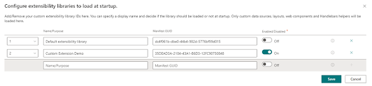
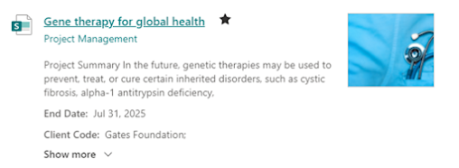
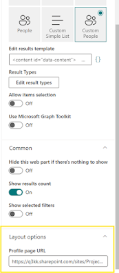

# PnP Modern Search Extensibility sample

This is a PnP Modern Search Extensibility library that depicts examples of following:

- Custom web components
- Custom layouts
- Custom Handlebars helpers

## Get Started

- Install and configure the [PnP Modern Search solution](https://microsoft-search.github.io/pnp-modern-search/installation/) in your SharePoint Online environment.
- Download the latest release of this package, bundle and package the solution and deploy it to your tenant or site collection app catalog.
- Connect the extensibilty library id (25DEAD3A-2104-43A1-B6D3-12FC90750847) with the PnP Modern Search Solution

## Creating custom layout
- You would be able to tranform the default list layout to be able to show  Project Title, Site, Project Summary, Project End Date, Client Code, whether a project is a featured project or not by showing a star beside the Project Title. Also, you would be able to show more project details such as capabilities, issue areas, segments in expandable/collapsible section as show in these images

- For step by step process of creating custom web component please follow [this](https://deepamoorjmalani.blogspot.com/2024/12/pnp-modern-search-extensibility_30.html) here.

## Creating custom web components
- Using custom webcomponent, I have extended the People result to include pronouns besides person's name, made the person card clickable, and have extended the hover card to have assistant and pronouns. Steps are available [here](https://deepamoorjmalani.blogspot.com/2024/12/pnp-modern-search-extensibility_87.html)

## Creating custom handlebar helpers
- trim and wasTrimmed handlebar helpers help in determining whether content was trimmed or not and then trim is used to actually trim the content. Steps are available [here](https://deepamoorjmalani.blogspot.com/2024/12/pnp-modern-search-extensibility_83.html)